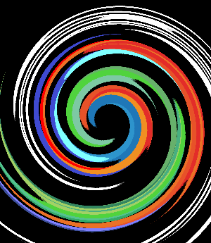

# S1 | Prog: Workshop Loïc Le Bray

Le résultats de mes exercices

## Exercices à 1 étoile

    <figure style="width:30%">
    
    <figcaption align = "center"><b>Ne garder que le vert</b></figcaption>
    </figure>
    <figure style="width:30%">
    
    <figcaption align = "center"><b>Echanger les canaux</b></figcaption>
    </figure>
    <figure style="width:30%">
    
    <figcaption align = "center"><b>Noir et blanc</b></figcaption>
    </figure>
    <figure style="width:30%">
    
    <figcaption align = "center"><b>Négatif</b></figcaption>
    </figure>
    <figure style="width:30%">
    
    <figcaption align = "center"><b>Dégradé</b></figcaption>
    </figure>

## Exercices à 2 étoiles
Pour l'exercice de rotation à 90°, j'ai d'abord obtenu la version miroir de la rotation, j'ai donc dû utiliser la fonction miroir pour obtenir cette image. J'ai réalisé qu'une rotation à 90° revient à un effet miroir vertical suivi d'un effet miroir horizontal, j'ai donc modifié mon code pour effectuer ces deux effet en une seule boucle.

    <figure style="width:30%">
    
    <figcaption align = "center"><b>Miroir</b></figcaption>
    </figure>
    <figure style="width:30%">
    
    <figcaption align = "center"><b>RGB split</b></figcaption>
    </figure>
    <figure style="width:30%">
    
    <figcaption align = "center"><b>Luminosité éclaircie</b></figcaption>
    </figure>
    <figure style="width:30%">
    
    <figcaption align = "center"><b>Luminosité assombrie</b></figcaption>
    </figure>
    <figure style="width:30%;">
    
    <figcaption align = "center"><b>Rotation de 90°</b></figcaption>
    </figure>

## Disque et dérivé
Pour cette suite d'exercices, j'ai réalisé qu'il était important de faire de la fonction dessinant le disque la plus modulable possible, afin de pouvoir facilement l'adapter aux différents exercices.

C'est pourquoi j'ai créé une fonction dessinant un cercle possède plein de paramètres : changer le rayon, la position du centre et l'épaisseur du trait.

J'en ai aussi profité pour donner la possibilité de changer les couleurs du cercle et du fond.

    <figure style="width:30%">
    
    <figcaption align = "center"><b>Disque de base</b></figcaption>
    </figure>
    <figure style="width:30%">
    
    <figcaption align = "center"><b>Disque modifié</b></figcaption>
    </figure>
    <figure style="width:30%">
    
    <figcaption align = "center"><b>Cercle de base</b></figcaption>
    </figure>
    <figure style="width:30%">
    
    <figcaption align = "center"><b>Cercle modifié</b></figcaption>

Pour la rosace, j'ai calculé la position des centre des cercles grâce à la formule de Pythagore, en me basant sur le fait que les centres des cercles adjacents sont équidistants, et forment donc des triangles équilatéraux.

Pour l'animation, il m'a suffit de légèrement changer la position du centre entre chaque image.

    <figure style="width:30%">
    
    <figcaption align = "center"><b>Rosace</b></figcaption>
    </figure>
    <figure style="width:30%">
    
    <figcaption align = "center"><b>animation</b></figcaption>
    </figure>

## Mosaïque
La première mosaïque est simple, il suffit de calculer la taille de la petite version de l'image à partir du nombre de "carreaux" (n) qu'on veut avoir en hauteur et largeur, puis copier 1 pixel de l'image dans la version petite tout les n pixel de la grande image et l'illusion est là, plus qu'à copié la petite image n*n dans la grande.

Pour la version miroir, je copie la petite image 4 par 4, toute les versions alternatives en même temps, mais il faut gérer le cas des bords à part.

    <figure style="width:30%">
    
    <figcaption align = "center"><b>Mosaïque 1/5</b></figcaption>
    </figure>
    <figure style="width:30%">
    
    <figcaption align = "center"><b>Mosaïque 1/7</b></figcaption>
    </figure>
    <figure style="width:30%">
    
    <figcaption align = "center"><b>Mosaïque miroir 1/5</b></figcaption>
    </figure>
    <figure style="width:30%">
    
    <figcaption align = "center"><b>Mosaïque miroir 1/7</b></figcaption>
    </figure>

## Exercices à 3 étoiles
Pour le glitch et le tri de pixel, j'ai du comprendre que des valeurs spécifiques sont nécessaires pour avoir un rendu intéressant, des rectangles plus large que haut pour les glitchs, et un tri par petits groupes de pixels (70) pour le tri de pixels.

Pour le glitch, il m'a fallu aussi créer une fonction pour échanger deux rectangles de même taille d'une image, et donc m'assurer que les deux rectangles ne se superposent pas.

    <figure style="width:30%">
    
    <figcaption align = "center"><b>Glitch</b></figcaption>
    </figure>
    <figure style="width:30%">
    
    <figcaption align = "center"><b>Tri de pixels</b></figcaption>
    </figure>

Le dégradé de couleur était particulièrement compliqué, il m'a fallu comprendre l'intérêt d'oklab, puis réalisé que la fonction pour passer au format oklab demande un format RGB (linear RGB) différent de celui utilisé dans le code (sRGB) et qu'il fallait donc effectuer deux changement de format, un mélange de couleur, puis à nouveau 2 changements de format.

    <figure style="width:30%">
    
    <figcaption align = "center"><b>Avec un seul changement de format</b></figcaption>
    </figure>
    <figure style="width:30%">
    
    <figcaption align = "center"><b>Joli dégradé</b></figcaption>
    </figure>

## Fractale de Mandelbrot
La fractale de Mandelbrot est assez simple si l'on garde l'interval [-2;2], il suffit de poser (249,249)=0+0i, puis d'utiliser la formule donnée. Et limiter la boucle testant  si le nombre complexe dérive à une valeur raisonnable (moins de 30), puis de faire un gradient de gris composé de 30 couleurs.

Pour avoir un zoom propre, il faut déjà trouver les bonnes extrémités en abscisse (la fractale est plus longue que large). Le minimum est -2, mais de l'autre coté, en tâtonnant, j'ai trouvé 1. La fractale est symétrique par l'axe des abscisses, donc en ordonnée les extrémités sont -1,5 et 1,5 (même distance qu'en abscisse, pour ne pas déformer la fractale).

il faut ensuite trouver le nouvel origine sur l'image, toujours 249 en ordonnée, mais pour l'abscisse, 0 donne -2 et 499 donne 1.
on a donc :
500px = 3 <=> 1 = 500px / 3 <=> 1 = 166
donc le centre a pour abscisse 499 - 166 = 333

Il ne reste plus qu'à retirer la valeur du centre puis diviser par 166 à la position en pixel pour avoir le nombre complexe.

    <figure>
    
    <figcaption align = "center"><b>[-2; 2] pour les 2 bornes</b></figcaption>
    </figure>
    <figure>
    
    <figcaption align = "center"><b>[-2; 1] et [-1,5; 1,5]</b></figcaption>
    </figure>

## Tramage
Pour le tramage j'ai utilisé les formules données, j'ai juste décidé de faire la formule calculant la matrice de Bayer (bayer_matrix dans quatre_etoile.cpp).
J'ai fait une version couleur et une version noir et blanc (changer l'image en noir et blanc avant le tramage).
##### Si les images semblent bizarre, modifier la taille de la fenêtre

    <figure>
    
    <figcaption align = "center"><b>Tramage noir et blanc</b></figcaption>
    </figure>
    <figure>
    
    <figcaption align = "center"><b>Tramage couleur</b></figcaption>
    </figure>

## Normalisation de l'histogramme
J'ai eut beaucoup de mal pour cet exercice, j'ai d'abord fait une fonction pour transformer le rgb en format hsl et inversement, pour pouvoir simplement modifier la luminance de la couleur en hsl, mais ma fonction ne change pas la couleur des pixels et je ne comprend pas pourquoi (mis en commentaire dans la fonction normalize_histogram du fichier quatre-etoile.cpp).

Je suis reparti de 0 et j'ai utilisé la formule de luminance calculé pour la transformation d'image en nuances de gris, puis j'ai calculé une formule qui transformerait la luminance minimale en noir et la maximale en blanc et distribue les couleurs entre de manière homogène (quatre_etoile.cpp ligne 123).

    <figure>
    
    <figcaption align = "center"><b>Normalisation de l'histogramme</b></figcaption>
    </figure>

## Vortex
J'ai simplement utilisé la fonction de rotation donnée, en liant la rotation au carré de la distance au centre, qui permet d'avoir cet effet de vortex, et pas juste des cercle.
Je ne savais pas comment gérer les pixels dont la rotation donnait une position en dehors de l'image, jusqu'à ce que je comprenne qu'on pouvait les ignorer.

    <figure style="width:30%">
    
    <figcaption align = "center"><b>Sans ignorer les pixels extérieurs</b></figcaption>
    </figure>
    <figure style="width:30%">
    
    <figcaption align = "center"><b>Vortex</b></figcaption>
    </figure>

## Convolution
Pour le programme applicant le kernel sur l'image, j'ai essayé de l'optimisé en gérant les bords dans des boucles à part, mais ça n'a pas changé grand chose.
Pour chaque pixel de l'image : je regarde les pixels autour et les multiplie à la position du kernel associé ; puis je les ajoute dans le pixel de la copie.

Pour le flou linéaire je n'utilise pas de kernel, je divise juste les valeurs par le carré du coté de la taille du kernel.

J'ai créé un programme qui crée un kernel de Gauss de la taille demandée et l'utilise sur l'image donnée (gaussian_convolution dans convolution.cpp). Malheureusement il ne marche pas.

Les autres effets sont assez basiques, j'ai juste réutilisé les kernels donnés

J'ai crée un kernel de détection de bord qui combine ceux verticaux et horizontaux que je trouve intéressant (il est proche de celui de l'effet emboss).

    <figure style="width:30%">
    
    <figcaption align = "center"><b>Flou linéaire</b></figcaption>
    </figure>
    <figure style="width:30%">
    
    <figcaption align = "center"><b>Flou linéaire</b></figcaption>
    </figure>
    <figure style="width:30%">
    
    <figcaption align = "center"><b>Flou gaussien échec</b></figcaption>
    </figure>
    <figure style="width:30%">
    
    <figcaption align = "center"><b>Emboss</b></figcaption>
    </figure>
    <figure style="width:30%">
    
    <figcaption align = "center"><b>Contour</b></figcaption>
    </figure>
    <figure style="width:30%">
    
    <figcaption align = "center"><b>Affinage</b></figcaption>
    </figure>
    <figure style="width:30%">
    
    <figcaption align = "center"><b>Détection des bords verticaux</b></figcaption>
    </figure>
    <figure style="width:30%">
    
    <figcaption align = "center"><b>Détection des bords horizontaux</b></figcaption>
    </figure>
    <figure style="width:30%">
    
    <figcaption align = "center"><b>Détection de tout les bords</b></figcaption>
    </figure>

