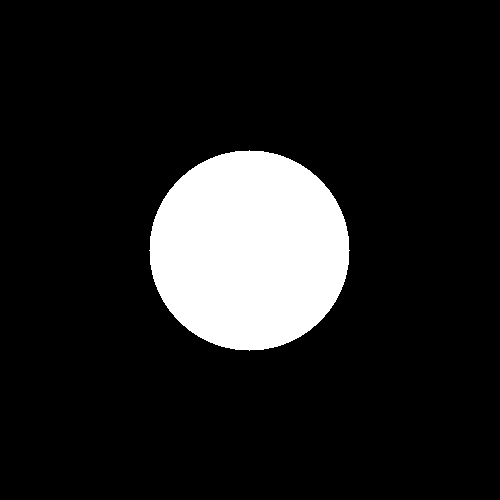

# S1 | Prog: Workshop Loïc Le Bray

Le résultats de mes exercices

## Exercices à 1 étoile

    <figure style="width:30%">
    
    <figcaption align = "center"><b>Ne garder que le vert</b></figcaption>
    </figure>
    <figure style="width:30%">
    
    <figcaption align = "center"><b>Echanger les canaux</b></figcaption>
    </figure>
    <figure style="width:30%">
    
    <figcaption align = "center"><b>Noir et blanc</b></figcaption>
    </figure>
    <figure style="width:30%">
    
    <figcaption align = "center"><b>Négatif</b></figcaption>
    </figure>
    <figure style="width:30%">
    
    <figcaption align = "center"><b>Dégradé</b></figcaption>
    </figure>

## Exercices à 2 étoiles

    <figure style="width:30%">
    
    <figcaption align = "center"><b>Miroir</b></figcaption>
    </figure>
    <figure style="width:30%">
    
    <figcaption align = "center"><b>RGB split</b></figcaption>
    </figure>
    <figure style="width:100%">
        
        
        <figcaption align = "center"><b>Luminosité: éclairci et assombri</b></figcaption>
    </figure>

<figure style="width:30%; float: left; margin: 5% 5% 0% 10%">

<figcaption align = "center"><b>Rotation de 90°</b></figcaption>
</figure>

Pour cet exercice j'ai d'abord obtenu la version miroir de la rotation, j'ai donc du utiliser la fonction miroir pour obtenir cette image. J'ai réalisé qu'une rotation à 90° revient à un effet miroir vertical suivi d'un effet miroir horizontal, j'ai donc modifié mon code pour effectuer ces deux effet en une seule boucle.

## Disque et dérivé
Pour cette suite d'exercices, j'ai réalisé qu'il était important de faire de la fonction dessinant le disque la plus modulable possible, afin de pouvoir facilement l'adapter aux différents exercices.
C'est pourquoi j'ai créé une fonction dessinant un cercle possède plein de paramètres : changer le rayon, la position du centre et l'épaisseur du trait.
J'en ai aussi profité pour donner la possibilité de changer les couleurs du cercle et du fond.

    <figure style="width:30%">
    
    <figcaption align = "center"><b>Disque de base</b></figcaption>
    </figure>
    <figure style="width:30%">
    
    <figcaption align = "center"><b>Echanger les canaux</b></figcaption>
    </figure>
    <figure style="width:30%">
    
    <figcaption align = "center"><b>Noir et blanc</b></figcaption>
    </figure>
    <figure style="width:30%">
    
    <figcaption align = "center"><b>Négatif</b></figcaption>
    </figure>
    <figure style="width:30%">
    
    <figcaption align = "center"><b>Dégradé</b></figcaption>
    </figure>

